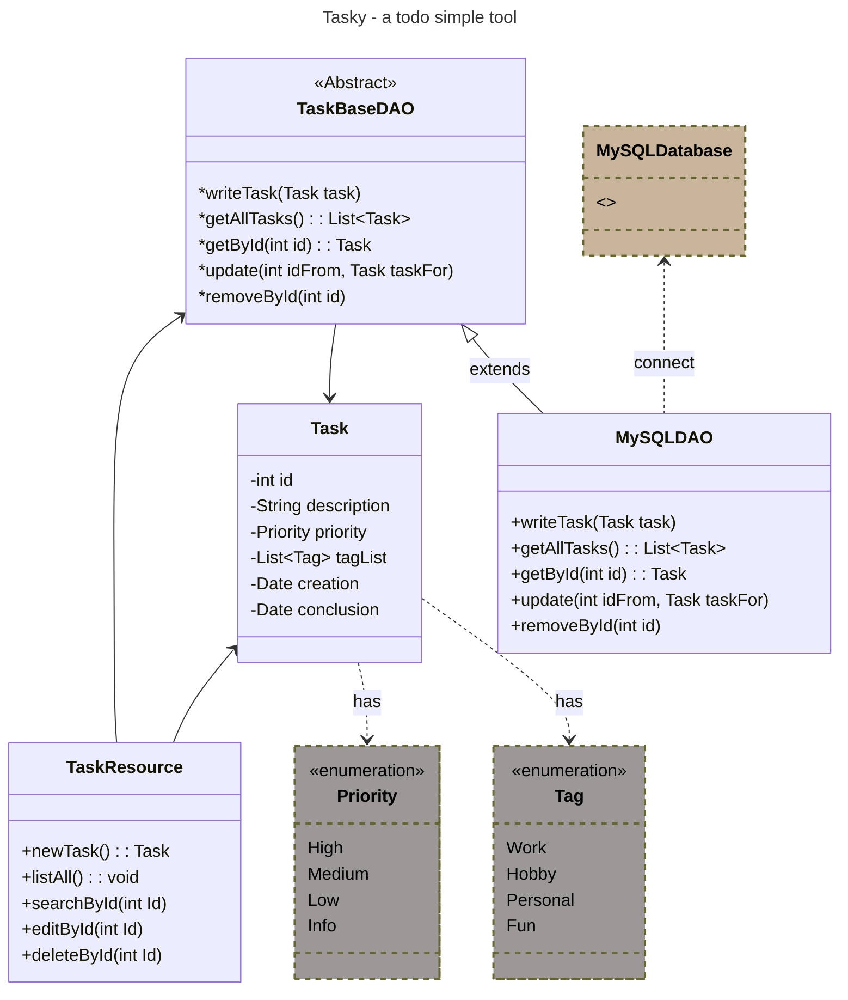

```mermaid
---
title: Tasky - a todo simple tool
---
classDiagram
    TaskBaseDAO <-- TaskResource
    TaskBaseDAO --> Task
    TaskBaseDAO <|-- MySQLDAO: extends
    Task <-- TaskResource
    Task ..> Priority: has
    Task ..> Tag: has
    MySQLDatabase <.. MySQLDAO : connect
    MySQLDatabase : <<DB>>
    class TaskBaseDAO {
        <<Abstract>>
        *writeTask(Task task)
        *getAllTasks(): List~Task~
        *getById(int id): Task
        *update(int idFrom, Task taskFor)
        *removeById(int id)
    }
    class MySQLDAO {
        +writeTask(Task task)
        +getAllTasks(): List~Task~
        +getById(int id): Task
        +update(int idFrom, Task taskFor)
        +removeById(int id)
    }
    class Task {
        -int id
        -String description
        -Priority priority
        -List~Tag~ tagList
        -Date creation
        -Date conclusion
    }
    class TaskResource {
        +newTask(): Task
        +listAll(): void
        +searchById(int Id)
        +editById(int Id)
        +deleteById(int Id)
    }
    class Priority {
        <<enumeration>>
        High
        Medium
        Low
        Info
    }
    class Tag {
        <<enumeration>>
        Work
        Hobby
        Personal
        Fun
    }
style Tag fill:#9c9898,stroke:#663,stroke-width:2px,color:#000,stroke-dasharray: 5 5
style Priority fill:#9c9898,stroke:#663,stroke-width:2px,color:#000,stroke-dasharray: 5 5
style MySQLDatabase fill:#c9b59b,stroke:#663,stroke-width:2px,color:#000,stroke-dasharray: 5 5
```