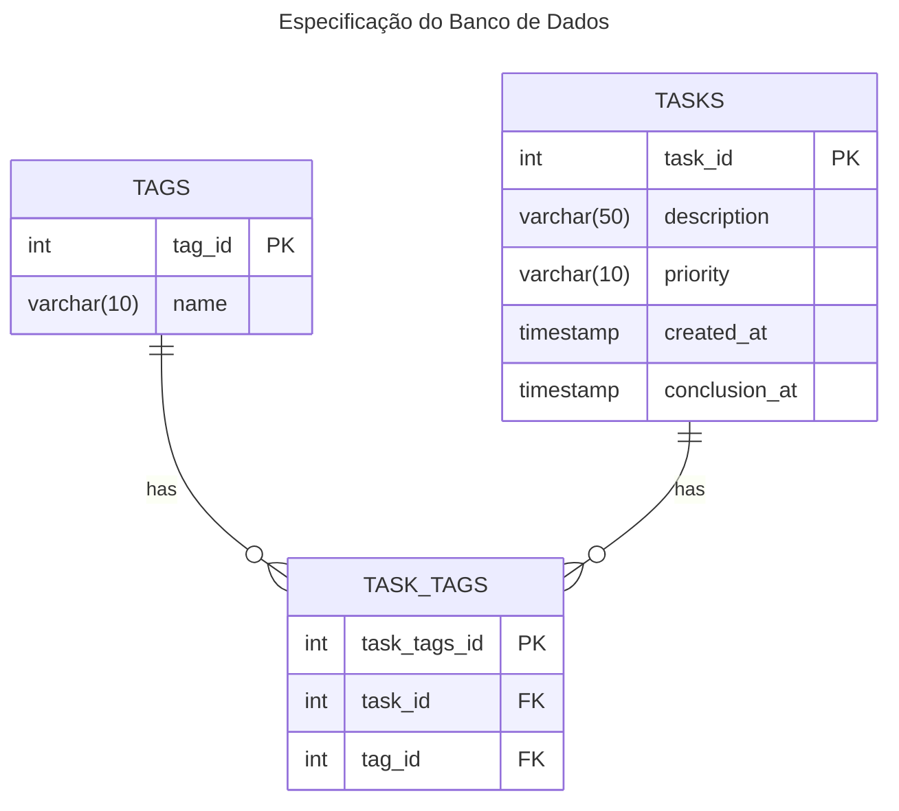

```mermaid
---
title: Especificação do Banco de Dados
---
erDiagram
    TAGS ||--o{ TASK_TAGS : has
    TASKS ||--o{ TASK_TAGS : has
    TASKS {
        int task_id PK
        varchar(50) description 
        varchar(10) priority 
        timestamp created_at
        timestamp conclusion_at
    }
    TAGS {
        int tag_id PK
        varchar(10) name
    }
    TASK_TAGS {
        int task_tags_id PK
        int task_id FK
        int tag_id FK
    }
```

