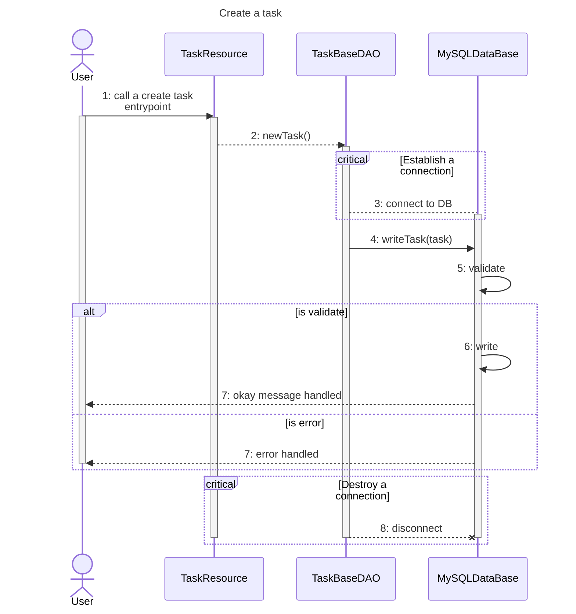
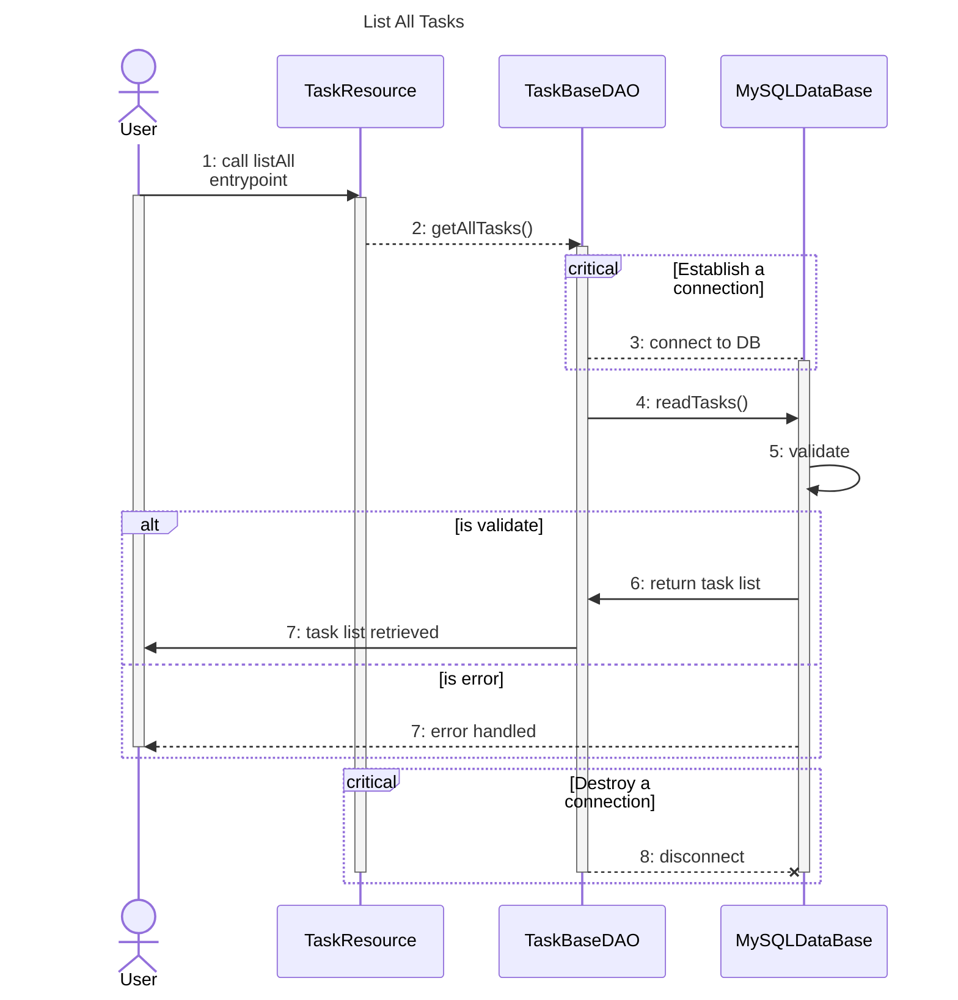
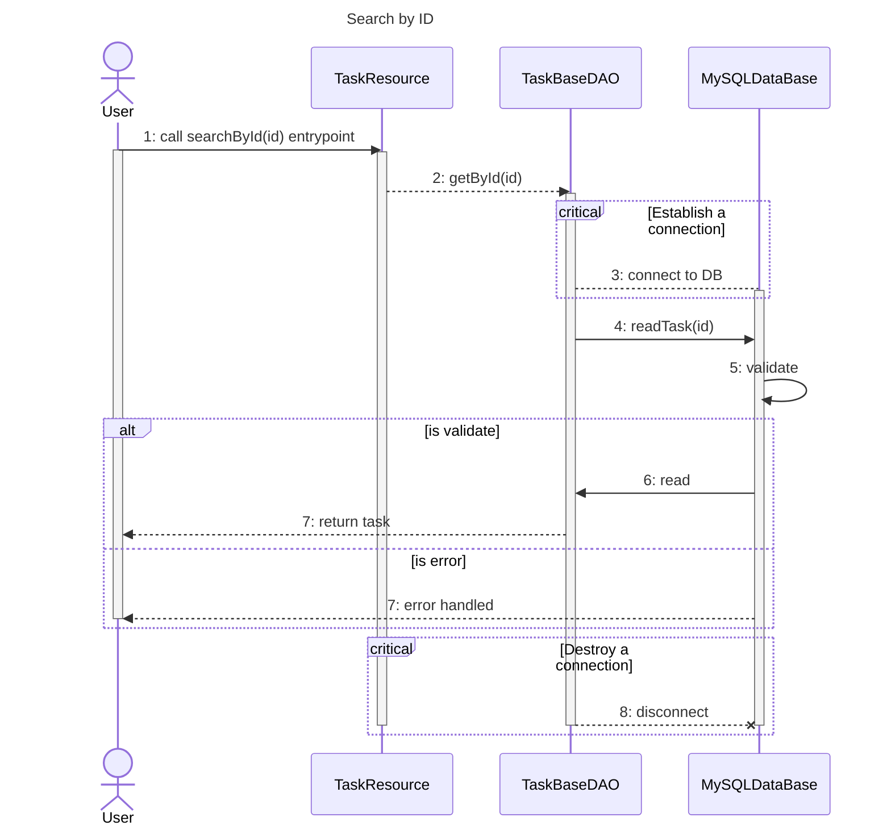
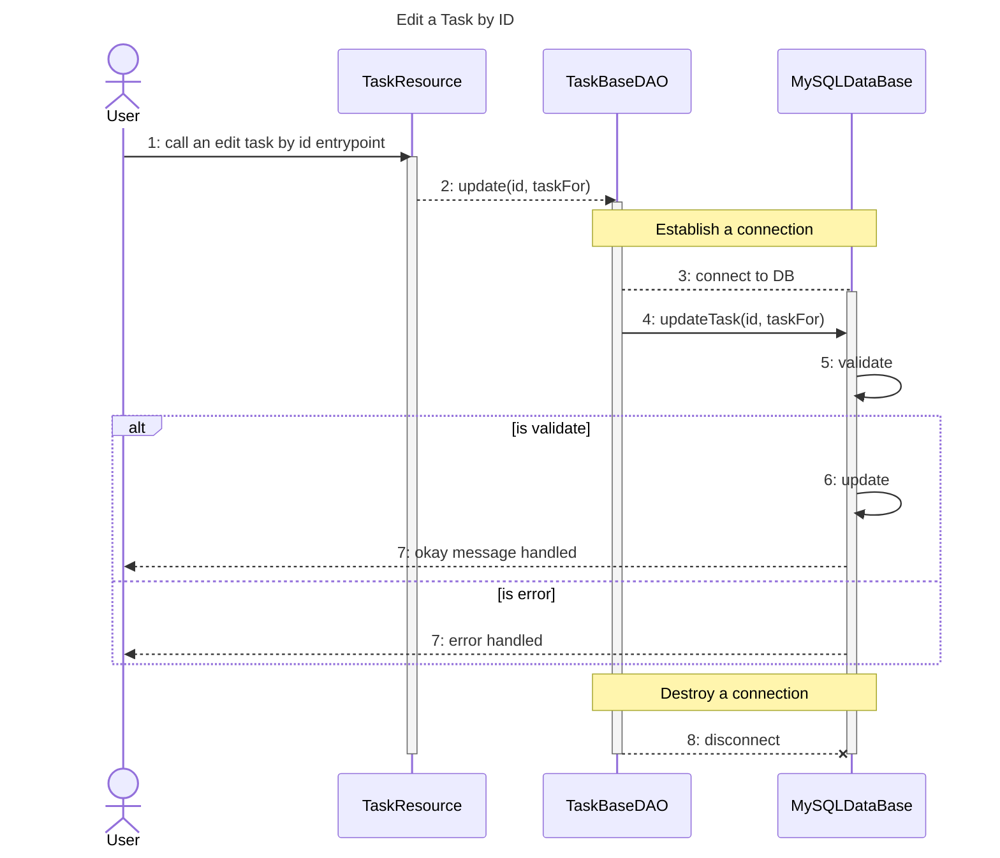

## API Usage Diagram

```mermaid
---
title: Create a task
---
sequenceDiagram
    actor User
    User ->> TaskResource: 1: call a create task<br/>entrypoint
    activate User
    activate TaskResource
    TaskResource -->> TaskBaseDAO: 2: newTask()
    activate TaskBaseDAO
    critical Establish a connection
        TaskBaseDAO --> MySQLDataBase: 3: connect to DB
        activate MySQLDataBase
    end
    TaskBaseDAO ->> MySQLDataBase: 4: writeTask(task)
    MySQLDataBase ->> MySQLDataBase: 5: validate
    alt is validate
        MySQLDataBase ->> MySQLDataBase: 6: write
        MySQLDataBase -->> User: 7: okay message handled
    else is error
        MySQLDataBase -->> User: 7: error handled
        deactivate User
    end
    critical Destroy a connection
        TaskBaseDAO --x MySQLDataBase: 8: disconnect
        deactivate MySQLDataBase
        deactivate TaskBaseDAO
        deactivate TaskResource
    end
```

```mermaid
---
title: List All Tasks
---
sequenceDiagram
    actor User
    User ->> TaskResource: 1: call listAll<br/>entrypoint
    activate User
    activate TaskResource
    TaskResource -->> TaskBaseDAO: 2: getAllTasks()
    activate TaskBaseDAO
    critical Establish a connection
        TaskBaseDAO --> MySQLDataBase: 3: connect to DB
        activate MySQLDataBase
    end
    TaskBaseDAO ->> MySQLDataBase: 4: readTasks()
    MySQLDataBase ->> MySQLDataBase: 5: validate
    alt is validate
        MySQLDataBase ->> TaskBaseDAO: 6: return task list
        TaskBaseDAO ->> User: 7: task list retrieved
    else is error
        MySQLDataBase -->> User: 7: error handled
        deactivate User
    end
    critical Destroy a connection
        TaskBaseDAO --x MySQLDataBase: 8: disconnect
        deactivate MySQLDataBase
        deactivate TaskBaseDAO
        deactivate TaskResource
    end
```

```mermaid
---
title: Search by ID
---
sequenceDiagram
    actor User
    User ->> TaskResource: 1: call searchById(id) entrypoint
    activate User
    activate TaskResource
    TaskResource -->> TaskBaseDAO: 2: getById(id)
    activate TaskBaseDAO
    critical Establish a connection
        TaskBaseDAO --> MySQLDataBase: 3: connect to DB
        activate MySQLDataBase
    end
    TaskBaseDAO ->> MySQLDataBase: 4: readTask(id)
    MySQLDataBase ->> MySQLDataBase: 5: validate
    alt is validate
        MySQLDataBase ->> TaskBaseDAO: 6: read
        TaskBaseDAO -->> User: 7: return task
    else is error
        MySQLDataBase -->> User: 7: error handled
        deactivate User
    end
    critical Destroy a connection
        TaskBaseDAO --x MySQLDataBase: 8: disconnect
        deactivate MySQLDataBase
        deactivate TaskBaseDAO
        deactivate TaskResource
    end
```

```mermaid
---
title: Edit a Task by ID
---
sequenceDiagram
    actor User
    User ->> TaskResource: 1: call an edit task by id entrypoint
    activate TaskResource
    TaskResource -->> TaskBaseDAO: 2: update(id, taskFor)
    activate TaskBaseDAO
    note over TaskBaseDAO,MySQLDataBase: Establish a connection
    TaskBaseDAO --> MySQLDataBase: 3: connect to DB
    activate MySQLDataBase
    TaskBaseDAO ->> MySQLDataBase: 4: updateTask(id, taskFor)
    MySQLDataBase ->> MySQLDataBase: 5: validate
    alt is validate
        MySQLDataBase ->> MySQLDataBase: 6: update
        MySQLDataBase -->> User: 7: okay message handled
    else is error
        MySQLDataBase -->> User: 7: error handled
    end
    note over TaskBaseDAO,MySQLDataBase: Destroy a connection
    TaskBaseDAO --x MySQLDataBase: 8: disconnect
    deactivate MySQLDataBase
    deactivate TaskBaseDAO
    deactivate TaskResource
```

```mermaid
---
title: Delete a task
---
sequenceDiagram
    actor User
    User ->> TaskResource: 1: call delete task<br/>entrypoint
    activate User
    activate TaskResource
    TaskResource -->> TaskBaseDAO: 2: deleteById(id)
    activate TaskBaseDAO
    critical Establish a connection
        TaskBaseDAO --> MySQLDataBase: 3: connect to DB
        activate MySQLDataBase
    end
    TaskBaseDAO ->> MySQLDataBase: 4: removeById(id)
    MySQLDataBase ->> MySQLDataBase: 5: validate
    alt is validate
        MySQLDataBase ->> MySQLDataBase: 6: delete
        MySQLDataBase -->> User: 7: okay message handled
    else is error
        MySQLDataBase -->> User: 7: error handled
        deactivate User
    end
    critical Destroy a connection
        TaskBaseDAO --x MySQLDataBase: 8: disconnect
        deactivate MySQLDataBase
        deactivate TaskBaseDAO
        deactivate TaskResource
    end
```