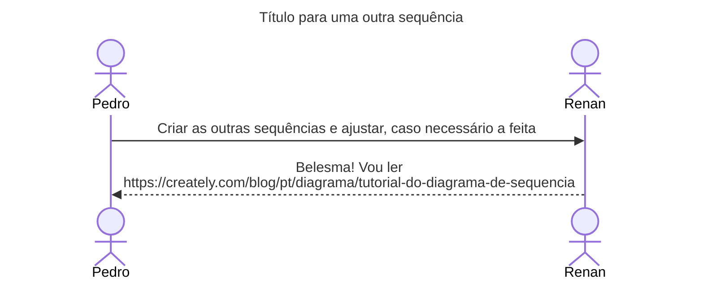

## API Usage Diagram


```mermaid
---
title: Create a task
---
sequenceDiagram
    actor User
    User ->> TaskResource: 1: call a create task<br/>entrypoint
    activate User
    activate TaskResource
    TaskResource -->> TaskBaseDAO: 2: newTask()
    activate TaskBaseDAO
    critical Establish a connection
        TaskBaseDAO --> MySQLDataBase: 3: connect to DB
        activate MySQLDataBase
    end
    TaskBaseDAO ->> MySQLDataBase: 4: writeTask(task)
    MySQLDataBase ->> MySQLDataBase: 5: validate
    alt is validate
        MySQLDataBase ->> MySQLDataBase: 6: write
        MySQLDataBase -->> User: 7: okay message handled
    else is error
        MySQLDataBase -->> User: 7: error handled
        deactivate User
    end
    critical Destroy a connection
        TaskBaseDAO --x MySQLDataBase: 8: desconnect
        deactivate MySQLDataBase
        deactivate TaskBaseDAO
        deactivate TaskResource
    end

```
```
TODO: Here the TODO mentioned in the Tag class.
```

```mermaid
---
title: Título para uma outra sequência
---
sequenceDiagram
    actor Pedro
    actor Renan
    Pedro->>Renan: Criar as outras sequências e ajustar, caso necessário a feita
    Renan-->>Pedro: Belesma! Vou ler <br/> https://creately.com/blog/pt/diagrama/tutorial-do-diagrama-de-sequencia
```